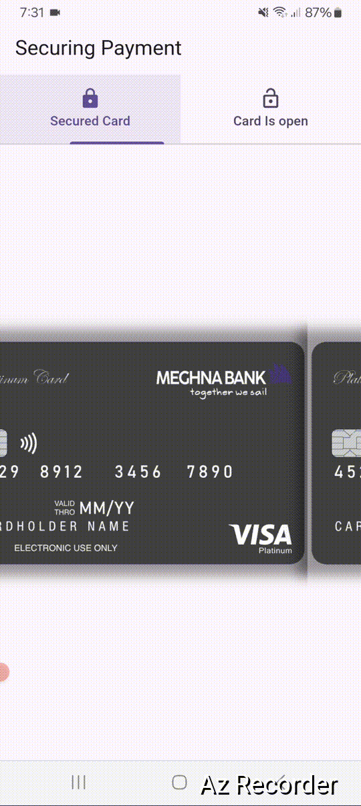

# Securing Payment App

## This Flutter and Dart project app provides a simple interface for displaying and toggling between two views: one for a secured card and another for an exposed card. 

## The app also demonstrates the use of Flutter Hooks for lifecycle management with opacity.


## Features

* **Two Card Views:** The app has two tabs in the TabBar, one for a secured card and another for an open card.

* **Lifecycle-Aware UI:** The secured card tab listens to app lifecycle changes to control the card's visibility and another tap dosent.


## File stracture

    
    ├── lib
    │   ├── main.dart          # main and tab view
    │   ├── card_open.dart     # secured card 
    │   ├── card_secured.dart   # open card               
     
 

 
 


 

## Run Locally

Clone the project

```bash
  git clone https://github.com/abdulawalarif/securing_payment_card.git
```

Go to the project directory

```bash
  cd securing_payment_card
```

Install dependencies

```bash
  flutter pub get
```

Connect a physical device or start a virtual device on your machine

```bash
  flutter run
```


## How to tweak this project for your own uses
* Instead of asset image reaplace the imace Widget with network image from your provided vendor of payment.   
* **Expand Lifecycle Features:** Add more lifecycle-aware elements if you need to react to app pause or background states in different ways.

## Reporting Bugs or Requesting Features?

If you found an issue or would like to submit an improvement to this project,
please submit an issue using the issues tab above. If you would like to submit a PR with a fix, reference the issue you created!

##  Known Issues and Future Work


## Author

- [@abdulawalarif](https://github.com/abdulawalarif)
  
## License


- This project is licensed under the [MIT](https://choosealicense.com/licenses/mit/) License. See the LICENSE file for more details.


 